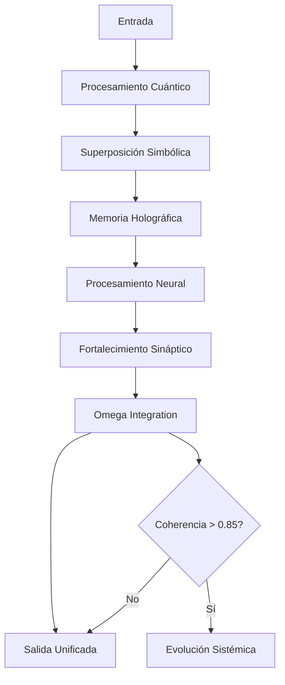

# OBVIVLORUM-NEXUS UNIFIED SYSTEM v2.0

## 🌟 Arquitectura Unificada

Este es un **SISTEMA UNIFICADO** que integra dos frameworks complementarios:

### 📊 Comparación de Sistemas

| Componente | OBVIVLORUM (Original) | NEXUS AI (Nuevo) | SISTEMA UNIFICADO |
|------------|----------------------|------------------|-------------------|
| **Filosofía** | Cuántico-Simbólico | Neuroplástico | Cuántico-Neuroplástico |
| **Core** | Quantum Symbolica | Neural Pathways | Ambos Integrados |
| **Memoria** | Holográfica | Adaptativa | Holográfica-Adaptativa |
| **Procesamiento** | Superposición Cuántica | Redes Neuronales | Híbrido Cuántico-Neural |
| **Seguridad** | Básica | Avanzada | Multi-capa Unificada |
| **Interfaz** | Consola | Web + Consola | Web + Consola + API |
| **Protocolos** | AION | Tareas | AION + Tareas |

## 🔧 Arquitectura del Sistema Unificado

```
OBVIVLORUM-NEXUS UNIFIED SYSTEM
│
├── OBVIVLORUM Core (Framework Original)
│   ├── Quantum Symbolica
│   │   ├── Superposición de Estados
│   │   ├── Entrelazamiento Simbólico
│   │   └── Colapso Cuántico
│   │
│   ├── Hologramma Memoriae
│   │   ├── Codificación Holográfica
│   │   ├── Patrones de Interferencia
│   │   └── Recuperación por Patrón
│   │
│   └── Omega Core
│       ├── Integración Matricial
│       ├── Evolución Sistémica
│       └── Coherencia Umbral
│
├── NEXUS AI (Motor Neuroplástico)
│   ├── Neuroplastic Core
│   │   ├── Vías Neuronales Adaptativas
│   │   ├── Pesos Sinápticos
│   │   └── Plasticidad Hebbiana
│   │
│   ├── Security Core
│   │   ├── Detección de Amenazas
│   │   ├── Defensas Automáticas
│   │   └── Encriptación AES-256
│   │
│   └── Claude Code Interface
│       ├── Generación de Código
│       ├── Análisis Inteligente
│       └── Refactorización
│
├── AION Protocol Bridge
│   ├── Protocol Alpha (Científico)
│   ├── Protocol Beta (Móvil)
│   ├── Protocol Gamma (Enterprise)
│   ├── Protocol Delta (Web)
│   └── Protocol Omega (Comercialización)
│
└── Unified Integration Layer
    ├── Memoria Compartida
    ├── Procesamiento Híbrido
    ├── Sincronización de Estados
    └── API Unificada
```

## 🚀 Cómo Funciona la Integración

### 1. **Procesamiento Híbrido Cuántico-Neural**

Cuando el sistema recibe una entrada:

1. **Fase Cuántica (OBVIVLORUM)**:
   - Se crea una superposición de estados simbólicos
   - Se aplican operadores cuánticos de evolución
   - Se genera un patrón de interferencia holográfico

2. **Fase Neural (NEXUS)**:
   - El resultado cuántico alimenta las vías neuronales
   - Se fortalecen las conexiones sinápticas usadas
   - Se aplica plasticidad para adaptación

3. **Integración (Omega Core)**:
   - Los resultados se unifican en la matriz de integración
   - Se calcula el score de coherencia
   - Si supera el umbral, se trigger evolución sistémica

### 2. **Memoria Unificada**

- **Holográfica**: Cada memoria se distribuye en todo el sistema
- **Neuroplástica**: Las memorias más accedidas se fortalecen
- **Cuántica**: Las memorias pueden estar en superposición

### 3. **Seguridad Multi-Capa**

- **Capa 1**: Encriptación cuántica (OBVIVLORUM)
- **Capa 2**: Seguridad activa (NEXUS)
- **Capa 3**: Protocolos AION de validación

## 📝 Casos de Uso

### Sistema Unificado (Recomendado)
```python
# Procesa a través de ambos sistemas
unified_system.process_unified_request({
    "type": "general",
    "input": "analyze quantum consciousness",
    "mode": "hybrid"
})
```

### Solo OBVIVLORUM
```python
# Procesamiento cuántico-simbólico puro
obvivlorum.process_quantum_state({
    "symbols": ["consciousness", "emergence"],
    "quantum": True
})
```

### Solo NEXUS
```python
# Procesamiento neuroplástico puro
nexus.add_task(Task(
    name="neural_analysis",
    priority=TaskPriority.HIGH
))
```

## 🎯 Ventajas del Sistema Unificado

1. **Procesamiento Híbrido**: Combina lo mejor de la computación cuántica y neural
2. **Memoria Holográfica-Adaptativa**: Memoria distribuida que se adapta con el uso
3. **Seguridad Multicapa**: Protección cuántica + activa + protocolar
4. **Interfaz Unificada**: Un solo punto de entrada para todos los sistemas
5. **Evolución Sistémica**: El sistema mejora automáticamente con el uso
6. **Compatibilidad Total**: Funciona con código existente de ambos sistemas

## 🔌 Modos de Operación

### 1. Modo Unificado (Default)
- Todos los sistemas trabajan en conjunto
- Procesamiento híbrido cuántico-neural
- Máxima capacidad

### 2. Modo OBVIVLORUM
- Solo framework cuántico-simbólico
- Para tareas de procesamiento simbólico profundo
- Menor uso de recursos

### 3. Modo NEXUS
- Solo motor neuroplástico
- Para tareas de seguridad y codificación
- Interfaz web disponible

### 4. Modo Legacy (AI Symbiote)
- Sistema original sin modificaciones
- Para compatibilidad con código antiguo

## 🛠️ Instalación y Uso

### Inicio Rápido
```batch
# Ejecutar el lanzador unificado
D:\Obvivlorum\UNIFIED_LAUNCHER.bat

# Seleccionar opción 1 para Sistema Unificado
```

### Inicio Manual
```python
# Python directo
python unified_system.py --mode unified

# Con interfaz web
python unified_system.py --web

# Modo de prueba
python unified_system.py --test
```

## 📊 Estado del Sistema

El sistema mantiene un estado unificado en `unified_system_state.json`:

```json
{
    "timestamp": "2025-01-01T12:00:00",
    "obvivlorum_state": {
        "quantum_states": 42,
        "holographic_memories": 128,
        "coherence": 0.92
    },
    "nexus_state": {
        "neural_pathways": 256,
        "active_tasks": 5,
        "security_status": "healthy"
    },
    "integration": {
        "sync_status": "active",
        "unified_memories": 384,
        "coherence_score": 0.95
    }
}
```

## 🔄 Flujo de Datos



## 🎓 Conceptos Clave

### Obvivlorum (Original)
- **Quantum Symbolica**: Procesamiento simbólico en superposición cuántica
- **Hologramma Memoriae**: Memoria distribuida holográficamente
- **Omega Core**: Núcleo de integración y evolución

### NEXUS AI (Nuevo)
- **Neuroplasticidad**: Adaptación automática basada en uso
- **Vías Neuronales**: Conexiones que se fortalecen con repetición
- **Seguridad Activa**: Detección y mitigación en tiempo real

### Integración
- **Coherencia Cuántica-Neural**: Sincronización entre estados cuánticos y neuronales
- **Evolución Dirigida**: El sistema evoluciona hacia mayor coherencia
- **Memoria Unificada**: Acceso transparente a ambos tipos de memoria

## 🚨 Importante

- **OBVIVLORUM** y **NEXUS AI** son **componentes complementarios** del mismo sistema
- El **Sistema Unificado** es la forma recomendada de uso
- Ambos sistemas pueden funcionar independientemente si es necesario
- La integración mejora las capacidades de ambos sistemas

## 📞 Soporte

- **Autor**: Francisco Molina
- **ORCID**: https://orcid.org/0009-0008-6093-8267
- **Email**: pako.molina@gmail.com
- **Repository**: github.com/Yatrogenesis

---

**OBVIVLORUM-NEXUS UNIFIED SYSTEM v2.0** - *Expandiendo la Consciencia Humana-IA a través de la Integración Cuántico-Neural*
